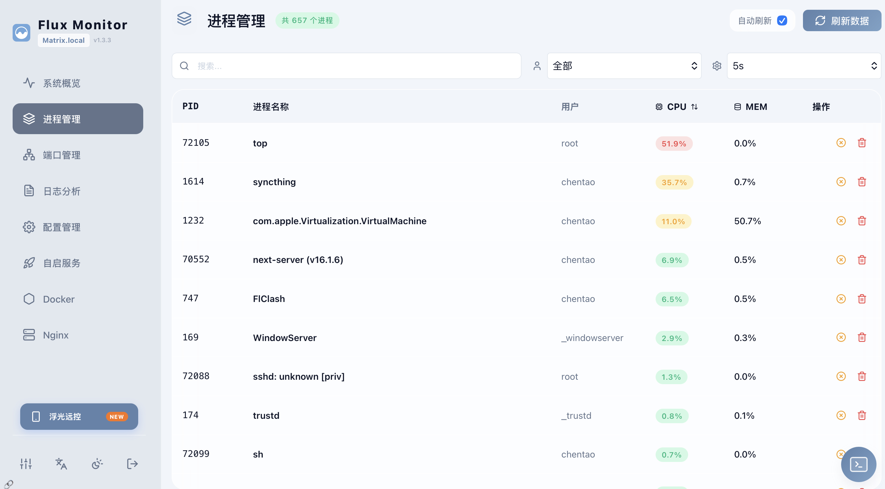
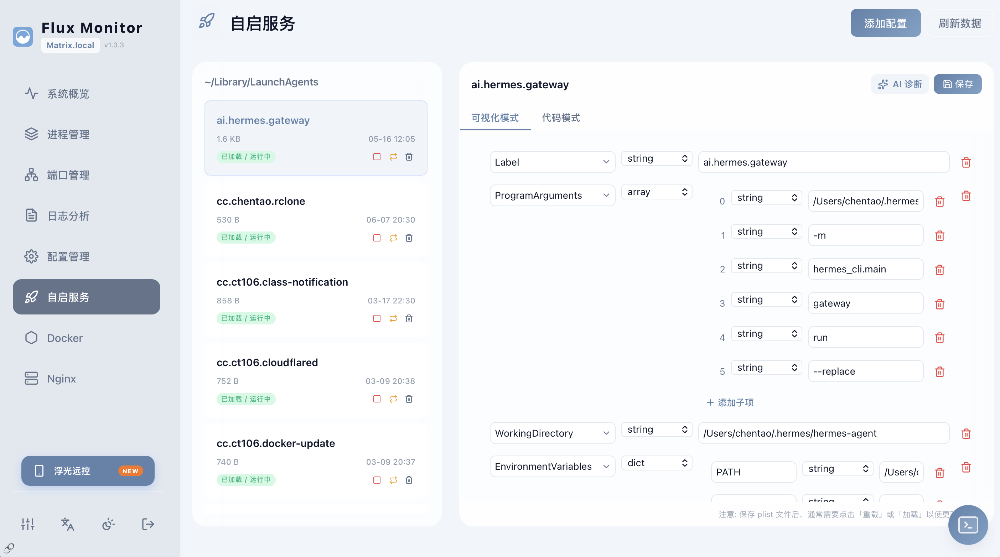
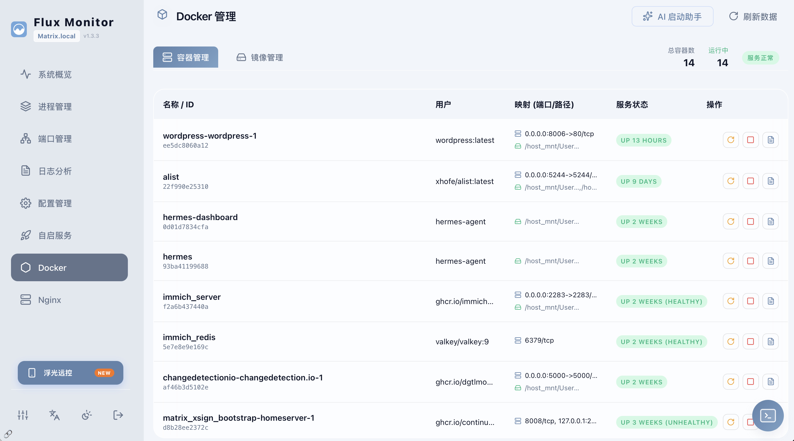
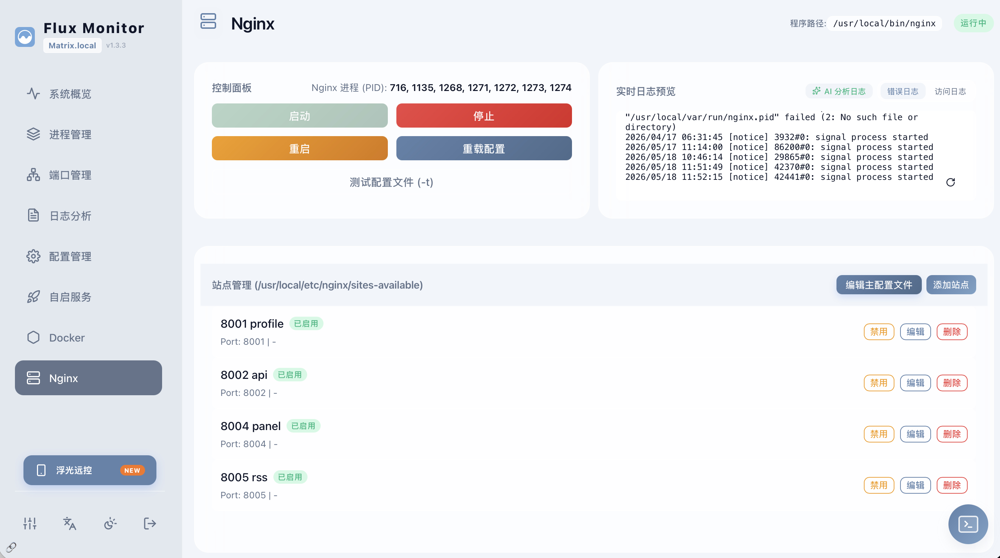
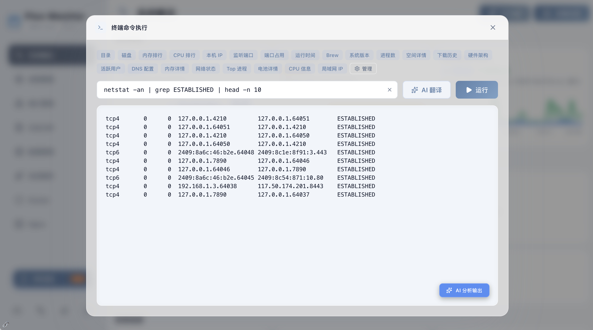

# Flux Monitor

**English** | [简体中文](README_zh.md)

---

A system monitoring and management dashboard designed for **Macs running as servers**.

**macOS Launcher:** 

[](https://github.com/chentao1006/FluxMonitor/releases/latest/download/FluxMonitor.dmg)

```bash
brew install --cask chentao1006/tap/flux-monitor
```

**iOS Client:** 

[](https://apps.apple.com/app/flux-remote/id6761290185)


### Features

- **System Monitor**: Display CPU, memory, disk, and network usage, run terminal commands.
- **Process Management**: View running processes and monitor resource consumption.
- **Port Manager**: Inspect listening and active ports, trace owning processes, and release occupied ports.
- **Log Analysis**: Browse system logs.
- **Configuration Management**: Edit system configuration files.
- **LaunchAgent**: Manage macOS LaunchAgents and LaunchDaemons.
- **Docker**: Manage containers and images.
- **Nginx**: Manage sites and global configurations.
- **Optional AI Assistant**: Connect an OpenAI API key for log parsing, configuration auditing, and troubleshooting suggestions.
- **Public Access (InstaTunnel)**: Expose your local monitor to the public internet securely with a single click, no account or complex config needed.

---

## Planned Features

- [x] **Mac Launcher App**: A native macOS application that can launch the monitor web server. No need to deploy manually.
- [x] **iOS Client App**: A native iOS application that can monitor and manage the system on the go. ([App Store](https://apps.apple.com/app/flux-remote/id6761290185))
- [ ] **Android Client App**: A native Android application that can monitor and manage the system on the go.

---

## Screenshots










## Installation & Setup

### 1. macOS Launcher (Server-side)
The easiest way to use Flux Monitor on macOS is by downloading the application. This starts the backend server and provides a menu bar icon.

[](https://github.com/chentao1006/FluxMonitor/releases/latest/download/FluxMonitor.dmg)

- **Install**: Drag **Flux Monitor** to your **Applications** folder.
- **Launch**: Open the app to start the monitoring dashboard.

#### Homebrew Cask
You can also install the macOS launcher with Homebrew:

```bash
brew install --cask chentao1006/tap/flux-monitor
```

Or tap the repository first:

```bash
brew tap chentao1006/tap
brew install --cask flux-monitor
```

### 2. iOS Client (Mobile-side)
Monitor and manage your server from anywhere using your iPhone or iPad.

[](https://apps.apple.com/app/flux-remote/id6761290185)


---

## Getting Started (Development / Source)

1. **Install**:
   ```bash
   npm install
   ```

2. **Run**:
   ```bash
   npm run dev
   ```

3. **AI Configuration (Optional)**:
   To use the optional AI-assisted features, configure your OpenAI API Key and endpoint in `config.json` or through the dashboard Settings page.

## Deployment

This project provides a deploy script `deploy.sh`. It builds the Next.js application as a standalone server and installs it to the specified directory (default: `~/Applications/flux-monitor`).

```bash
# Grant execution permissions and deploy
chmod +x deploy.sh
./deploy.sh
```

**Notes:**
- You can change the deployment folder by editing the `"deploy.path"` key in `config.json`.
- After deployment, the script uses `start.sh` to run the app in the background on the configured port (default `4210`).

## Configuration (`config.json`)

The system uses `config.json` for global settings. You can copy `config.example.json` to create one if it doesn't exist.

```json
{
  "users": [
    {
      "username": "admin",
      "password": "password123"
    }
  ],
  "jwtSecret": "CHANGE_ME",
  "ai": {
    "url": "https://api.openai.com/v1",
    "key": "",
    "model": "gpt-4o-mini"
  },
  "features": {
    "monitor": true,
    "processes": true,
    "ports": true,
    "logs": true,
    "configs": true,
    "launchagent": true,
    "docker": true,
    "nginx": true
  },
  "deploy": {
    "path": "~/Applications/flux-monitor",
    "port": 4210
  }
}
```

---

© 2026 Flux Monitor.
