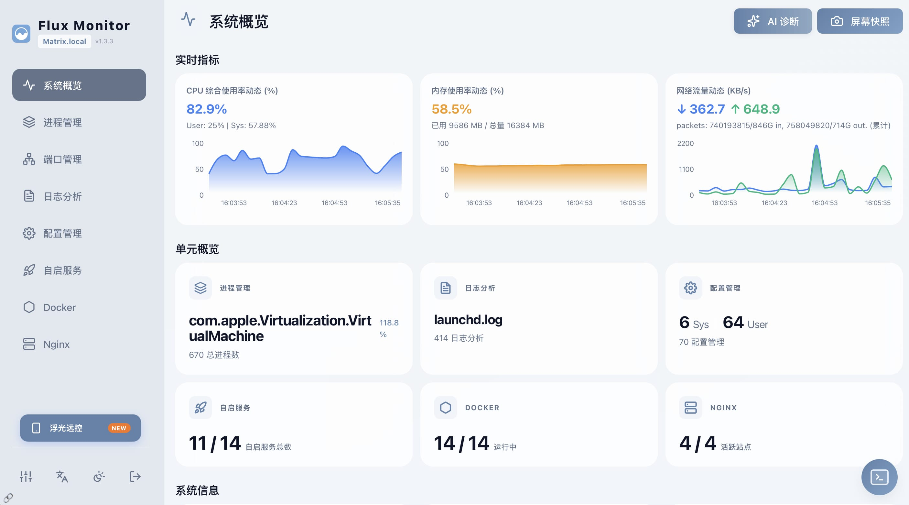
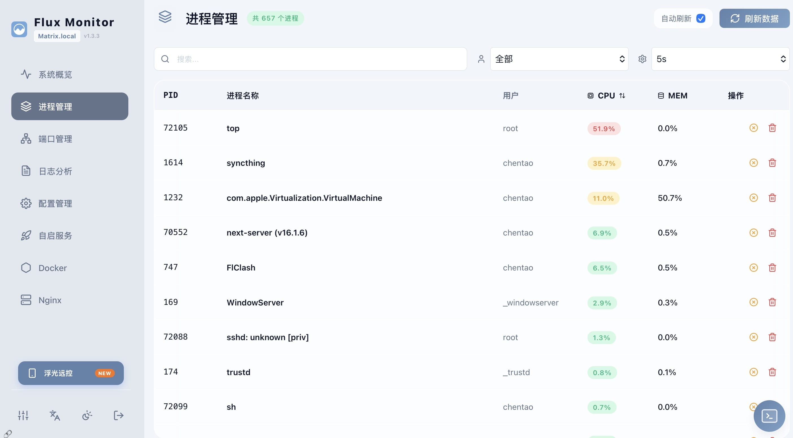
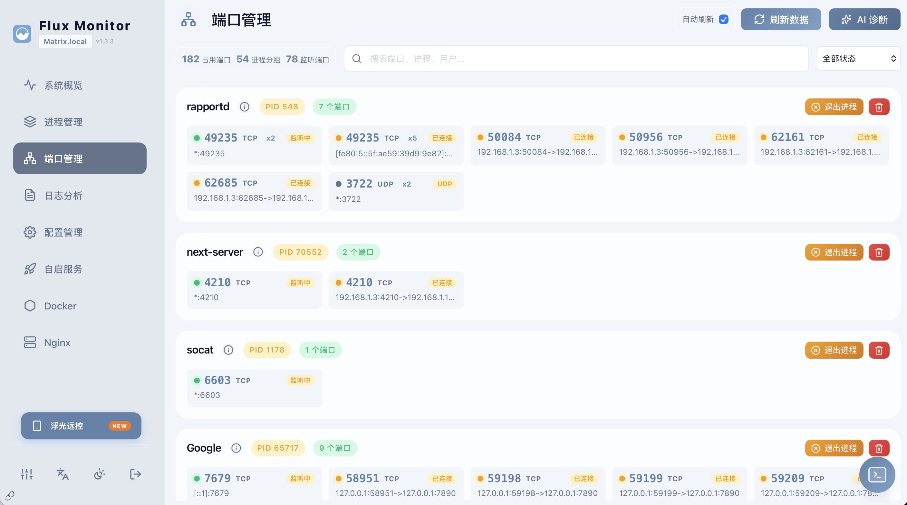
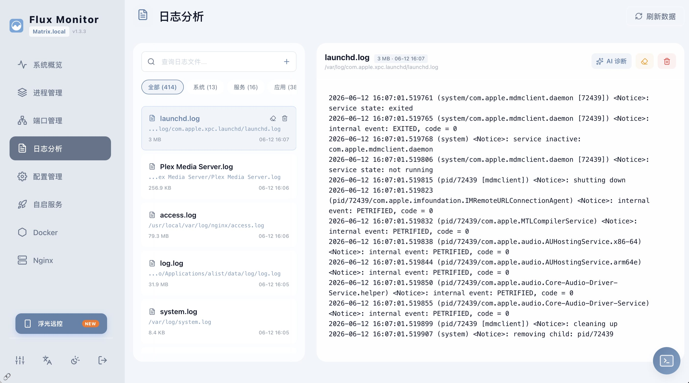
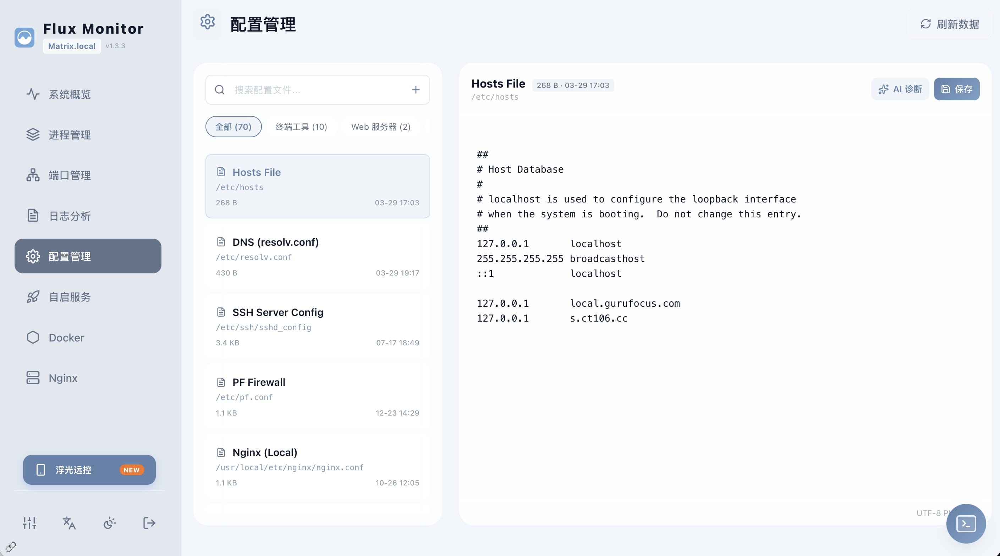
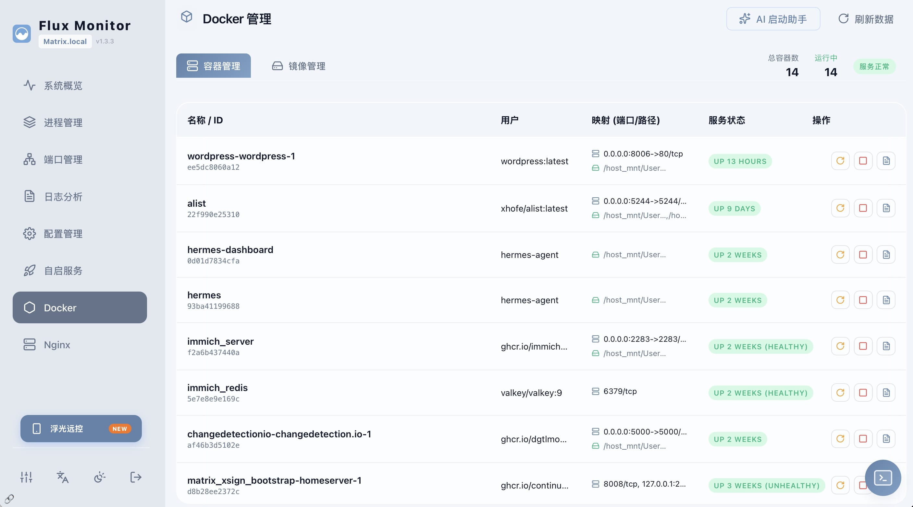
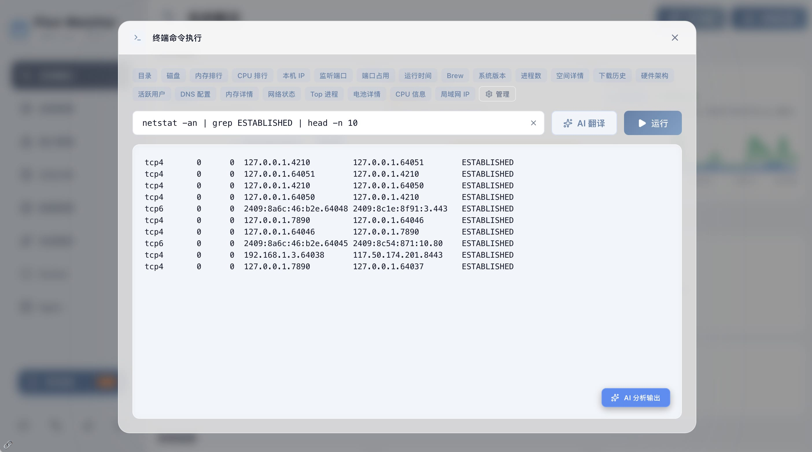

# 浮光面板

[English](README.md) | **简体中文**

---

一款专为作为服务器运行的 Mac 设计的监控与服务管理面板。

**macOS 启动器:** 

[](https://github.com/chentao1006/FluxMonitor/releases/latest/download/FluxMonitor.dmg)

```bash
brew install --cask chentao1006/tap/flux-monitor
```

**iOS 客户端:** 

[](https://apps.apple.com/app/flux-remote/id6761290185)


### 功能

- **系统概览**: 显示 CPU、内存、磁盘使用率及网络流量，运行终端命令。
- **进程管理**: 展示运行进程及其资源消耗。
- **端口管理**: 查看监听与活跃端口，定位占用进程并释放端口。
- **日志分析**: 查看系统日志。
- **配置文件管理**: 编辑并管理系统配置文件。
- **自启服务管理**: 管理 macOS 的 LaunchAgents 与 LaunchDaemons 服务。
- **Docker**: 管理容器与镜像。
- **Nginx**: 管理站点及全局配置。
- **选配 AI 助手**: 绑定 OpenAI API 密钥后，可使用日志诊断、参数配置审查及故障排查辅助功能。
- **公网访问 (InstaTunnel)**: 一键开启公网访问，无需账号或复杂配置，安全便捷。

**待开发功能**

- [x] **浮光面板启动器**: 原生 macOS 应用程序，可启动监控 Web 服务器，无需手动部署。
- [x] **iOS 客户端**: 原生 iOS 应用程序，可随时随地监控和管理系统。([App Store](https://apps.apple.com/app/flux-remote/id6761290185))
- [ ] **Android 客户端**: 原生 Android 应用程序，可随时随地监控和管理系统。

---

## 界面截图











## 安装与设置

### 1. macOS 启动器 (服务端)
在 macOS 上使用“浮光”最简单的方法是下载应用程序。它会自动启动后端服务并提供菜单栏图标。

[](https://github.com/chentao1006/FluxMonitor/releases/latest/download/FluxMonitor.dmg)

- **安装**: 将 **Flux Monitor** 拖入 **Applications** (应用程序) 文件夹。
- **启动**: 打开应用程序即可开启监控面板。

#### Homebrew Cask
也可以通过 Homebrew 安装 macOS 启动器：

```bash
brew install --cask chentao1006/tap/flux-monitor
```

或先添加 tap：

```bash
brew tap chentao1006/tap
brew install --cask flux-monitor
```

### 2. iOS 客户端 (移动端)
在 iPhone 或 iPad 上随时随地监控和管理您的服务器。

[](https://apps.apple.com/app/flux-remote/id6761290185)


---

## 开始使用 (源码 / 开发)

1. **安装**:
   ```bash
   npm install
   ```

2. **运行**:
   ```bash
   npm run dev
   ```

3. **配置 AI 引擎 (可选)**:
   若要使用选配的 AI 辅助功能，请在设置页面内或编辑 `config.json` 文件添加 OpenAI API 密钥和接口。

## 部署打包

本项目提供了一个部署脚本 `deploy.sh`。执行脚本会将 Next.js 应用编译并提取为独立的 Standalone 服务，安装到指定目录（默认路径：`~/Applications/flux-monitor`）。

```bash
# 赋予执行权限并构建发布版本
chmod +x deploy.sh
./deploy.sh
```

**说明:**
- 若要更改存放目录，请修改 `config.json` 中的 `deploy.path` 字段.
- 部署完成后，将生成 `start.sh` 并自动将面板挂载在后台相应的端口运行，默认为 `4210`。

## 配置文件说明 (`config.json`)

系统通过 `config.json` 作为全局配置。初始时可复制 `config.example.json` 来创建。

```json
{
  "users": [
    {
      "username": "admin",
      "password": "password123" // 登录账号密码
    }
  ],
  "jwtSecret": "CHANGE_ME", // 用于会话 Token 的密钥，务必修改
  "ai": {
    "url": "https://api.openai.com/v1", // 兼容 OpenAI 的接口地址
    "key": "", // AI 助手密钥
    "model": "gpt-4o-mini" // 使用的 AI 模型
  },
  "features": {
    "monitor": true, // 开启/关闭侧边栏可见的功能模块
    "processes": true,
    "ports": true,
    "logs": true,
    "configs": true,
    "launchagent": true,
    "docker": true,
    "nginx": true
  },
  "deploy": {
    "path": "~/Applications/flux-monitor", // 一键部署的目标路径
    "port": 4210 // 部署后运行的端口号
  }
}
```

---

© 2026 Flux Monitor.
